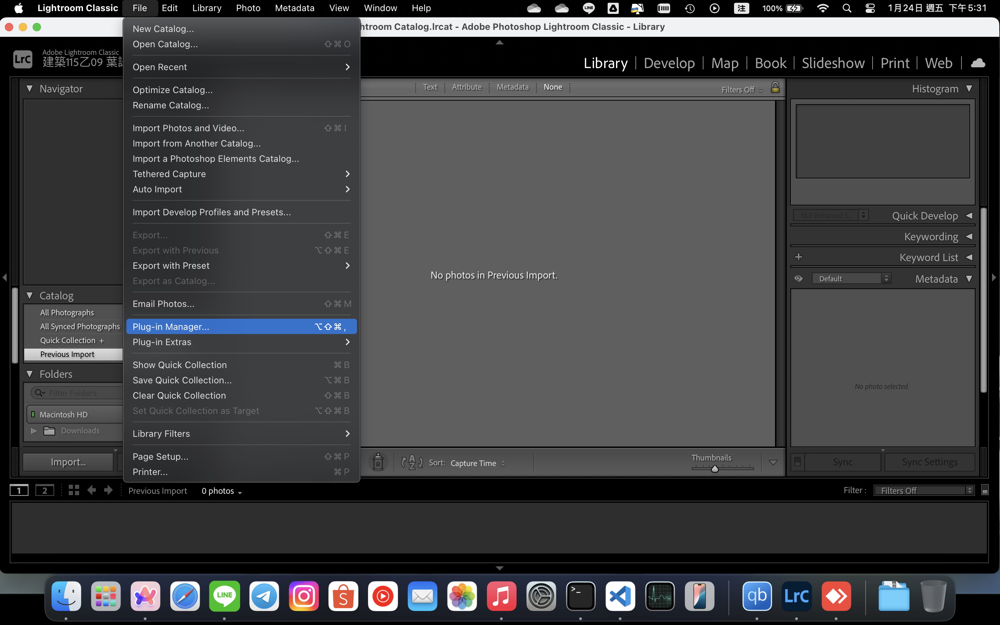
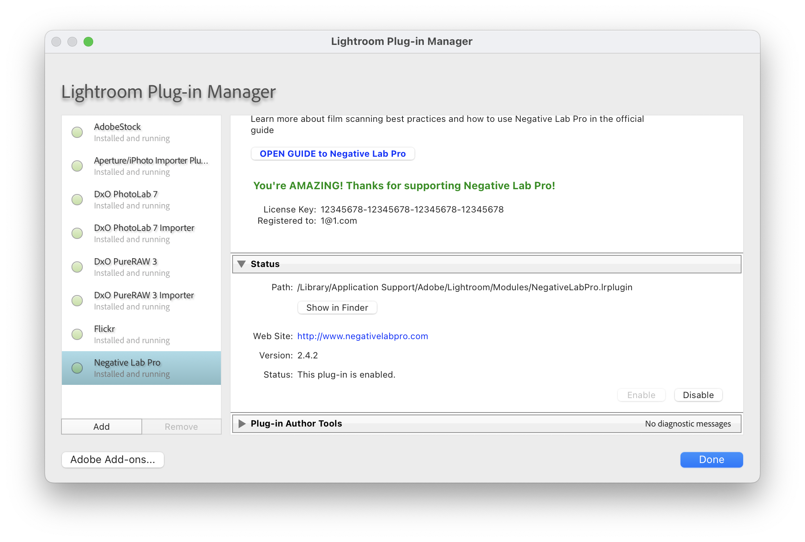
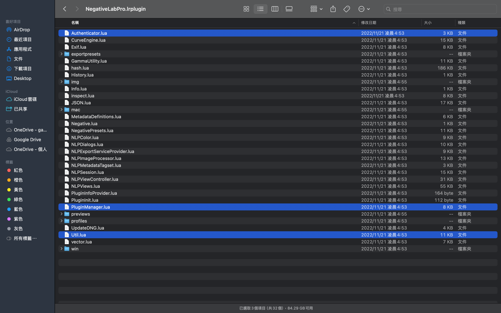

1. Download the Negative Lab Pro trial version (2.X.X) from https://www.negativelabpro.com/
2. Install NegativeLabPro
3. Open Plug-in Manager(File->Plug-in Manager) and find negativelabpro, click open in Finder

4. Backup Authenticator.lua, Util.lua, PluginManager.lua

5. Add the Authenticator.lua, Util.lua, PluginManager.lua files from this folder
6. Start Lightroom Classic CC

7. Use the key 12345678 to activate NegativeLabPro in Lightroom Classic CC
8. Exit Lightroom Classic CC
9. Delete Util.lua, PluginManager.lua, Authenticator.lua
10. Restore the original Util.lua, PluginManager.lua, Authenticator.lua
11. Done! Now you have an activated version of Negative Lab Pro. If you like it, consider purchasing it from the developer.
